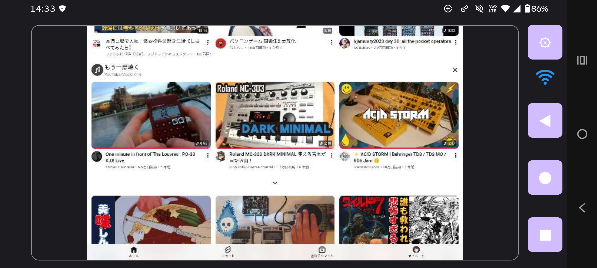
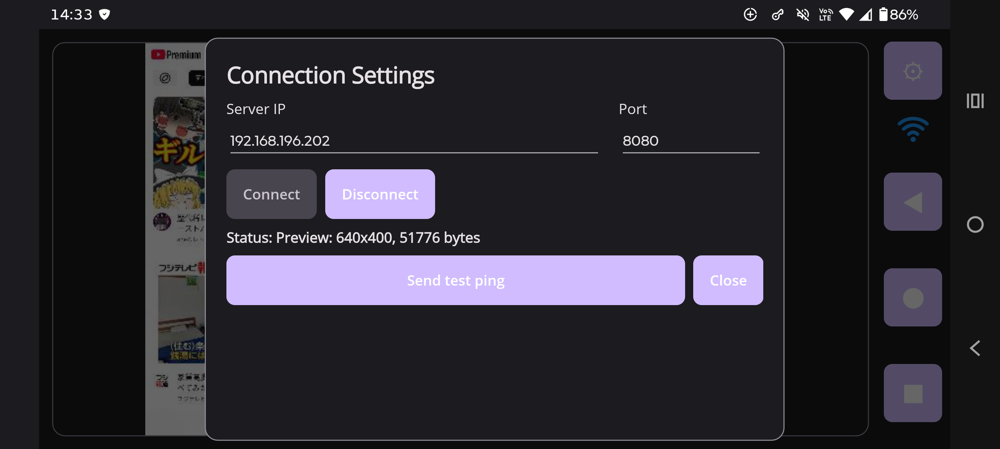
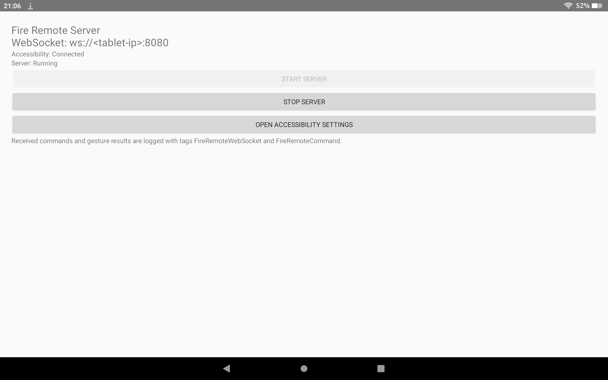

# Fire Tablet Remote

アームなどに固定したFire Tabletを、Androidスマートフォンから同一LAN経由で操作するためのリモートコントローラーです。ベッドなどFire Tabletから離れた場所から、YouTubeをはじめとするアプリを操作する用途を想定しています。

## Screenshots

### Controller Preview



Fire Tabletの現在画面を低解像度Previewとして表示し、Preview上からTap / Long Press / Swipeを操作できます。右側ツールバーからBack / Home / RecentsとConnection Settingsを操作します。

### Controller Connection Settings



### Fire Remote Server



## Features

- Fire Tablet画面の低解像度Preview
- Preview上でのTap / Long Press / Swipe
- Back / Home / Recentsのナビゲーション操作
- スマートフォンのLandscape専用リモコンUI
- 同一LAN内のWebSocket通信
- 接続先IPアドレスとPortの保存
- 接続状態表示と5秒の接続タイムアウト

Previewは動画ストリーミングではなく、約1秒間隔で更新される低解像度の静止画です。

## Requirements

### FireRemoteServer

- 確認済み: Fire HD 10 第13世代 / Fire OS 8系
- Android API 30以降に相当するScreenshot APIとAccessibilityServiceが必要です

他のFire Tabletでも動作する可能性はありますが、現時点では未確認です。

### FireRemoteController

- Android 11 / API 30以上
- Landscape表示
- 主な確認対象: Motorola Edge 50 Pro / Android 16
- 開発確認: Pixel 9 API 36 Emulator

Fire TabletとController端末を同じ信頼できるLANへ接続してください。

## Install

[GitHub Releases](https://github.com/fumakillers/FireTabletRemote/releases)から次のAPKをダウンロードし、それぞれの端末へインストールします。

- Fire Tablet: `FireRemoteServer-v0.1.0.apk`
- Androidスマートフォン: `FireRemoteController-v0.1.0.apk`

v0.1.0のAPKは、production用署名設定が未導入のためdebug署名のDebug buildです。Google Play配布用ではなく、APKを端末へ直接インストールして使用します。

端末の設定によっては、ブラウザやファイルアプリに「不明なアプリのインストール」の許可が必要です。

## Fire Tabletのセットアップ

1. `FireRemoteServer-v0.1.0.apk`をFire Tabletへインストールします。
2. **Fire Remote Server**を起動します。
3. **Open Accessibility Settings**を押します。
4. Accessibility設定で**Fire Remote Accessibility**を有効にします。
5. アプリへ戻り、`Accessibility: Connected`を確認します。
6. **Start server**を押します。
7. `Server: Running`を確認します。

Fire OSのバージョンによって、Accessibility設定の名称や階層が異なる場合があります。その場合は、ユーザー補助またはインストール済みサービスに相当する設定から**Fire Remote Accessibility**を有効にしてください。

### Fire TabletのIPアドレス

Fire TabletのWi-Fi詳細画面などから、同一LAN内で使用しているローカルIPv4アドレスを確認してください。Controllerの接続設定でこのアドレスを使用します。IPアドレスはルーターの設定などにより変わる場合があります。

## Controllerのセットアップ

1. `FireRemoteController-v0.1.0.apk`をAndroidスマートフォンへインストールします。
2. **Fire Remote Controller**をLandscapeで起動します。
3. 右側ツールバー上部のSettingsボタン（歯車）を押します。
4. **Server IP**へFire TabletのローカルIPv4アドレスを入力します。
5. **Port**が`8080`であることを確認します。
6. **Connect**を押します。
7. 右側のWi-Fi状態アイコンがConnectedを示し、Previewが表示されることを確認します。

Server IPとPortは端末へ保存され、次回起動時に復元されます。接続できない場合は、Fire側が`Server: Running`であること、両端末が同じLANにいること、端末やネットワークのFirewall設定をご確認ください。

## Operations

### Preview

Fire Tabletの現在画面を約1秒間隔の静止画として表示します。

### Tap

Preview上の操作したい位置を短くタップします。

### Long Press

Preview上の操作したい位置を約0.6秒以上長押しします。

### Swipe

Preview上で開始位置から終了位置までドラッグまたはスワイプします。

### Navigation

右側ツールバーのボタンを使用します。

- `◀` Back
- `●` Home
- `■` Recents
- 歯車 Connection Settings

## Network and Security

Protocol v1には認証とTLSがありません。通信には平文WebSocket（`ws://`）とPort `8080`を使用します。

信頼できる家庭内LANなどでのみ使用してください。FireRemoteServerのPort `8080`をインターネットへ直接公開しないでください。

## Limitations

- Previewは約1fpsの低解像度静止画であり、動画ではありません
- DRM、`FLAG_SECURE`、その他OS制約のある画面は取得できない、または黒く表示される場合があります
- 自動端末探索は未実装です
- 認証とTLSは未実装です
- Fire TabletとControllerはLandscapeでの使用を前提としています
- 主な動作確認対象はFire HD 10 第13世代 / Fire OS 8系です
- Fire OSやAndroidの仕様により、一部画面や操作でAccessibilityServiceの動作が制限される場合があります

## Development

### Repository structure

```text
FireRemoteServer/          Kotlin / Android server
FireRemoteController/      .NET MAUI Android controller
FireRemoteController.Tests/ Controller unit tests
assets/screenshots/        README screenshots
protocol/                  JSON WebSocket Protocol v1
docs/                      Architecture notes
tools/MockWebSocketServer/ Controller development mock server
```

主要技術:

- Server: Kotlin / Android / Foreground Service / AccessibilityService / Java-WebSocket
- Controller: .NET MAUI / C# / ClientWebSocket

### Server build and test

```powershell
cd FireRemoteServer
./gradlew.bat testDebugUnitTest
./gradlew.bat assembleDebug
```

### Controller build and test

```powershell
dotnet test FireRemoteController.Tests/FireRemoteController.Tests.csproj
dotnet build FireRemoteController/FireRemoteController.csproj -f net10.0-android
```

### Mock WebSocket Server

FireRemoteServerを使用せずControllerの接続やpingを確認できます。

```powershell
dotnet run --project tools/MockWebSocketServer --urls http://0.0.0.0:8080
```

Android EmulatorからホストPCへ接続する場合、通常はServer IPに`10.0.2.2`を使用します。ホスト側Firewallで受信許可が必要になる場合があります。

## Protocol and Architecture

- [WebSocket Protocol v1](protocol/README.md)
- [Architecture](docs/architecture.md)

## License

ライセンスは現時点では明示されていません。利用・再配布を検討する場合はRepositoryの最新情報をご確認ください。
